 

 

### ▸ SECTOR MAP

| Stage | World | State |
|:--|:--|:--|
| `1-1` | [ActivKlass](https://github.com/danadepz?tab=repositories) — classroom activity platform | ▶ in progress |
| `1-2` | [SPXExpress-Web](https://github.com/danadepz/SPXExpress-Web) | ✓ cleared |
| `1-3` | [SPXExpress-Mobile](https://github.com/danadepz/SPXExpress-Mobile) | ✓ cleared |
| `1-4` | [ResVerity](https://github.com/danadepz/ResVerity) | ✓ cleared |
| `1-5` | [EnrollmentSytem](https://github.com/danadepz/EnrollmentSytem) | ✓ cleared |

 

### ▸ RUN HISTORY

<picture>
  <source media="(prefers-color-scheme: dark)" srcset="https://github-readme-activity-graph.vercel.app/graph?username=danadepz&bg_color=0b0d16&color=7d8590&line=7ee787&point=e6edf3&area=true&area_color=7ee787&hide_border=true&custom_title=commits%20per%20day" />
  
</picture>

  

<code>GAME OVER? no. CONTINUE? yes.</code>

