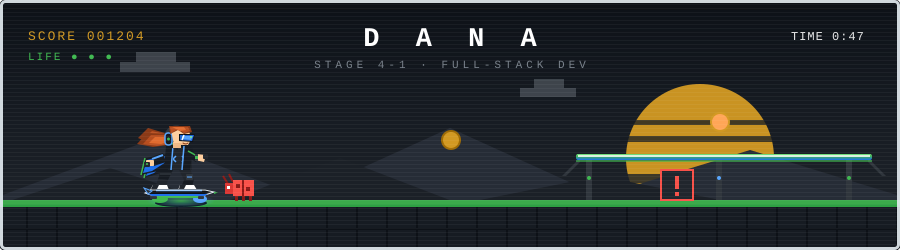
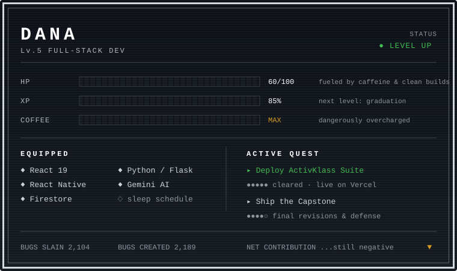

 

 

### ▸ SECTOR MAP

| Stage | World | State |
|:--|:--|:--|
| `1-1` | [ActivKlass Web](https://github.com/danadepz/activklass-web) — LMS & class record portal ([Live Demo](https://activklass.vercel.app/)) | 🟢 live |
| `1-2` | [ActivKlass Mobile](https://github.com/danadepz/activklass-mobile) — Expo React Native mobile app | ✓ cleared |
| `1-3` | [Helm](https://github.com/danadepz/Helm) — local operations hub for Claude Code CLI | ✓ cleared |
| `1-4` | [SPXExpress-Web](https://github.com/danadepz/SPXExpress-Web) & [Mobile](https://github.com/danadepz/SPXExpress-Mobile) — logistics platform | ✓ cleared |
| `1-5` | [ResVerity](https://github.com/danadepz/ResVerity) — research verification tool | ✓ cleared |
| `1-6` | [EnrollmentSytem](https://github.com/danadepz/EnrollmentSytem) | ✓ cleared |

 

<code>GAME OVER? no. CONTINUE? yes.</code>

